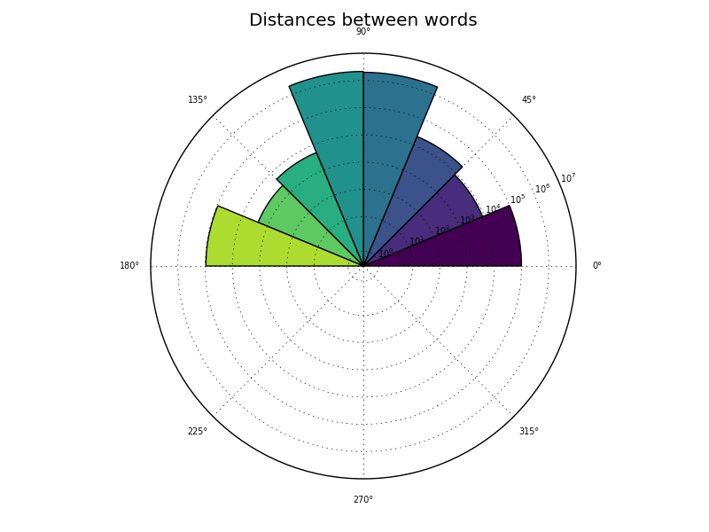
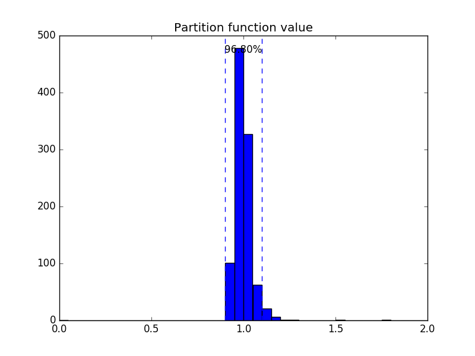

======================
Use cases: Static Word Embeddings
======================

Some miscellaneous options and use cases for using Mangoes to work with static word embeddings.

.. note:: **Doctest Mode**

   The code in the above examples are written in a *python-console* format.
   If you wish to easily execute these examples in **IPython**, use::

      %doctest_mode

   in the IPython console. You can then simply copy and paste the examples
   directly into IPython without having to worry about removing the **>>>**
   manually.

Creating a Corpus from simple text
----------------------------------

If your corpus consists of a set of text files, preferably tokenized, you can initialize a :class:`.Corpus` object with:

    >>> import mangoes
    >>> corpus = mangoes.Corpus('path/to/corpus')

Once it is initialized, you have access to the number of sentences, the number of words and the frequencies of words in
your corpus:

    >>> print(corpus.size, "sentences")
    10969 sentences
    >>> print(len(corpus.words_count), "words")
    2751 words
    >>> print(corpus.words_count["a"])
    168

The :class:`.Corpus` is also a generator, allowing you to read your corpus sentence by sentence, returning each sentence as a list
of words.

    >>> for sentence in corpus: # doctest: +ELLIPSIS
    ...     print(sentence)
    ['Anarchism']
    ...
    ['Anarchism', 'is', 'a', 'political', 'philosophy', ..., 'based', 'on', 'voluntary', 'institutions', '.']
    ...

.. seealso::
   :class:`.Corpus` documentation and :ref:`parameters for Corpus <corpus-params>`

Creating a Corpus from annotated text
-------------------------------------

If your corpus has been preprocessed and annotated, you have to declare the appropriate Reader to read it.
The :mod:`mangoes.corpus` module of Mangoes provides 4 readers corresponding to 4 annotation formats:
:class:`mangoes.corpus.XML`, :class:`mangoes.corpus.CONLL`, :class:`mangoes.corpus.CONLLU`
and :class:`mangoes.corpus.BROWN`.

    >>> annotated_corpus = mangoes.Corpus('path/to/xml/corpus', reader=mangoes.corpus.XML, ignore_punctuation=True)
    >>> for sentence in annotated_corpus: # doctest: +ELLIPSIS, +NORMALIZE_WHITESPACE
    ...     print(sentence)
    [Token(id='1', form='Anarchism', lemma='Anarchism', POS='NNP', features='_', head='5', dependency_relation='nsubj'),
     Token(id='2', form='is', lemma='be', POS='VBZ', features='_', head='5', dependency_relation='cop'),
     Token(id='3', form='a', lemma='a', POS='DT', features='_', head='5', dependency_relation='det'),
     Token(id='4', form='political', lemma='political', POS='JJ', features='_', head='5', dependency_relation='amod'),
     Token(id='5', form='philosophy', lemma='philosophy', POS='NN', features='_', head='0', dependency_relation='root'),
     Token(id='6', form='that', lemma='that', POS='WDT', features='_', head='7', dependency_relation='nsubj'),
    ...

.. note::
    You can also implement and use your own Reader, provided it extends :class:`mangoes.utils.reader.SentenceGenerator`

Save/load metadata of a Corpus
------------------------------
You can save the metadata associated with a Corpus to load it later.
Saved metadata are:

    >>> corpus.save_metadata(".corpus_metadata")
    >>> corpus = mangoes.Corpus.load_from_metadata(".corpus_metadata")

Creating a Vocabulary from a Corpus
-----------------------------------

To create a :class:`.Vocabulary` with all the words in your :class:`.Corpus`:

    >>> vocabulary = corpus.create_vocabulary()
    >>> print(len(vocabulary))
    2751

You can also use filters when creating a vocabulary from a Corpus.

:mod:`mangoes.corpus` module provides 3 types of filters that can be chained:

* a filter for removing elements defined in a list: :func:`mangoes.corpus.remove_elements`
* 2 filters for removing elements, based on their frequencies: :func:`mangoes.corpus.remove_most_frequent` and :func:`mangoes.corpus.remove_least_frequent`
* a filter for truncating and keeping only a given number of elements: :func:`mangoes.corpus.truncate`

    >>> vocabulary_100 = corpus.create_vocabulary(filters=[mangoes.corpus.remove_least_frequent(10),
    ...                                                mangoes.corpus.truncate(100)])
    >>> print(len(vocabulary_100))
    100
    >>> print(vocabulary_100[:10])
    ['the', ',', 'of', '.', 'and', '"', 'in', 'a', 'to', 'as']

.. tip::
    To remove punctuation from your Vocabulary:

    >>> import string
    >>> punctuation_filter = mangoes.corpus.remove_elements(string.punctuation)
    >>> vocabulary_no_punct = corpus.create_vocabulary(filters=[punctuation_filter])
    >>> print(vocabulary_no_punct[:10])
    ['the', 'of', 'and', 'in', 'a', 'to', 'as', 'anarchist', 'was', 'that']

    To remove stopwords:

    >>> import nltk.corpus
    >>> stopwords_filter = mangoes.corpus.remove_elements(nltk.corpus.stopwords.words('english'))
    >>> vocabulary_no_stopwords = corpus.create_vocabulary(filters=[stopwords_filter])
    >>> print(vocabulary_no_stopwords[:10])
    [',', '.', '"', 'anarchist', 'anarchism', 'The', '-LRB-', '-RRB-', 'In', 'anarchists']

    To remove any list of words, and combine filters:

    >>> my_words_filter = mangoes.corpus.remove_elements(['-LRB-', '-RRB-', '-lrb-', '-rrb-'])
    >>> my_vocabulary = corpus.create_vocabulary(filters=[punctuation_filter, stopwords_filter, my_words_filter])
    >>> print(my_vocabulary[:10])
    ['anarchist', 'anarchism', 'The', 'In', 'anarchists', "'s", 'movement', 'International', 'state', 'Anarchist']

.. note::
    You can also write and use your own filters. A filter is a function that takes a :class:`collections.Counter`
    as input and returns a :class:`collections.Counter`. The function should be decorated with
    `@mangoes.utils.decorators.counter_filter`

If the Corpus is annotated, you can also filter the attributes you want to consider in your Vocabulary:

    >>> lemma_vocabulary = annotated_corpus.create_vocabulary(attributes="lemma",
    ...                                                       filters=[punctuation_filter, stopwords_filter, my_words_filter])
    >>> print(lemma_vocabulary[:10])
    ['anarchist', 'anarchism', 'The', 'In', 'anarchists', "'s", 'movement', 'International', 'Anarchist', 'state']

    >>> lemma_pos_vocabulary = annotated_corpus.create_vocabulary(attributes=("lemma", "POS"))
    >>> print(lemma_pos_vocabulary[:2])
    [Token(lemma='the', POS='DT'), Token(lemma=',', POS=',')]

Count co-occurrences in a Corpus
--------------------------------
Once you have defined your Corpus and your Vocabulary(ies), use the
:mod:`mangoes.counting` module to count how many times the words of your vocabulary(ies) co-occur in the Corpus:

    >>> import mangoes.counting
    >>> counts_matrix = mangoes.counting.count_cooccurrence(corpus, vocabulary, vocabulary)
    >>> print(counts_matrix.shape)
    (2751, 2751)

This creates an object of class :class:`mangoes.CountBasedRepresentation`.

The `context_definition` parameter lets you define which words are considered to co-occurr. The default value
is a symmetric window of size 1 around each word. 

The module :mod:`mangoes.context` provides the :class:`Window` class that you can use to define window-type
context and parametrize to make it symmetric or not, dynamic or not, dirty or not:

    >>> import mangoes.context
    >>> window_5 = mangoes.context.Window(window_half_size=5, vocabulary=vocabulary)
    >>> counts_matrix = mangoes.counting.count_cooccurrence(corpus, vocabulary, context=window_5)

.. note::
    You can also write and use your own contexts. A context definition is a callable class that takes a sentence and
    returns the list of the elements of the sentence to consider as the context of each word of the sentence.

.. seealso::
   :func:`.count_cooccurrence` documentation and :ref:`parameters for counting <counting-params>`

Create a Representation from a co-occurrence matrix
-------------------------------------------------
The :func:`mangoes.create_representation` function turns a counting
matrix into a Representation, applying weighting and/or dimension reduction.

:class:`.Representation` is an abstract class that encapsulates a matrix and a vocabulary.
Mangoes provides 2 implementation of this class:

* the CountBasedRepresentation class for storing sparse matrices with words represented by the rows of the matrix and words used as contexts (the columns of the matrix).
* the Embeddings class for storing low-dimension, dense matrices with words represented by the rows of the matrix.

The :mod:`mangoes.weighting` module provides variants of Pointwise
Mutual Information (PMI) to be used as `weighting` parameter, while
the :mod:`mangoes.reduction` module implements PCA et SVD to be used as `reduction` parameter.

    >>> import mangoes.weighting, mangoes.reduction
    >>> ppmi = mangoes.weighting.PPMI()
    >>> svd = mangoes.reduction.SVD(dimensions=50)
    >>> embedding = mangoes.create_representation(counts_matrix, weighting=ppmi, reduction=svd)

.. note::
    You can also write and use your own transformations functions.
    A transformation definition is a callable class that takes a :class:`mangoes.utils.arrays.Matrix` as input and
    returns a :class:`mangoes.utils.arrays.Matrix`.
    The function should inherit from `.Transformation`

Create an Embedding from your data
----------------------------------

If you already have vectors that you want to use in Mangoes, you first have to create an Embeddings object.

    >>> import mangoes
    >>> import numpy as np
    >>> my_vocabulary = ['a', 'b', 'c']
    >>> my_vectors = np.random.random_sample((3,4))
    >>> embedding = mangoes.Embeddings(mangoes.Vocabulary(my_vocabulary), my_vectors)

Mangoes also provides a convenience function to load a representation created with `gensim <http://radimrehurek.com/gensim/>`_ :

    >>> import mangoes
    >>> embedding = mangoes.Embeddings.load_from_gensim('./from_gensim.kv')

Evaluate an Embedding on intrinsic Tasks
---------------------------------------------------------
The :mod:`mangoes.evaluation` package currently provides 3 kinds of task to evaluate a representation :
Word Similarity, Analogy and Outlier Detection (and some statistical tools)
For each of these tasks, some datasets are available in the modules :

    >>> import mangoes.evaluation.analogy
    >>> analogy_evaluation = mangoes.evaluation.analogy.Evaluation(embedding, mangoes.evaluation.analogy.GOOGLE)
    >>> print(analogy_evaluation.get_report())
                                                                Nb questions      cosadd      cosmul
    ================================================================================================
    Google                                                         327/20050      44.04%      42.51%
                                                    (including 9 duplicates)
    ------------------------------------------------------------------------------------------------

    >>> import mangoes.evaluation.similarity
    >>> ws_evaluation = mangoes.evaluation.similarity.Evaluation(embedding, *mangoes.evaluation.similarity.ALL_DATASETS)
    >>> print(ws_evaluation.get_report()) # doctest: +NORMALIZE_WHITESPACE
                                                                              pearson       spearman
                                                          Nb questions        (p-val)        (p-val)
    ================================================================================================
    WS353                                                       61/353   0.505(3e-05)   0.493(5e-05)
    ------------------------------------------------------------------------------------------------
    WS353 relatedness                                           49/252   0.434(2e-03)   0.411(3e-03)
    ------------------------------------------------------------------------------------------------
    WS353 similarity                                            36/203   0.656(1e-05)   0.526(1e-03)
    ------------------------------------------------------------------------------------------------
    MEN                                                       183/3000   0.587(2e-18)   0.592(1e-18)
    ------------------------------------------------------------------------------------------------
    M. Turk                                                     17/287   0.736(8e-04)    0.58(1e-02)
    ------------------------------------------------------------------------------------------------
    Rareword                                                    9/2034   0.771(1e-02)   0.733(2e-02)
    ------------------------------------------------------------------------------------------------
    RG65                                                          2/65    -1.0(0e+00)      -1.0(nan)
    ------------------------------------------------------------------------------------------------

    >>> import mangoes.evaluation.outlier
    >>> outlier_evaluation = mangoes.evaluation.outlier.Evaluation(embedding, *mangoes.evaluation.outlier.ALL_DATASETS)
    >>> print(outlier_evaluation.get_report())
                                                                Nb questions         OPP    accuracy
    ================================================================================================
    8-8-8                                                               4/64     100.00%     100.00%
    ------------------------------------------------------------------------------------------------
    wiki-sem-500                                                      1/2812     100.00%     100.00%
    ------------------------------------------------------------------------------------------------

Each task can also have specific parameters, like the evaluation metric to use: check their documentation.

Analyse some statistical properties of the Embedding
----------------------------------------------------
The :mod:`mangoes.visualize` module provides some functions to
illustrate some properties of the embedding. 

.. note::
   You have to install `matplotlib <https://matplotlib.org>`_ to use this module

Distances
^^^^^^^^^

:func:`.plot_distances` produces an histogram of the distances between
      each pair of words.

    >>> import matplotlib.pyplot as plt
    >>> import mangoes.visualize
    >>> fig = plt.figure()
    >>> ax = plt.subplot(111, projection='polar') # since distances are angles, we use here a circular histogram
    >>> mangoes.visualize.plot_distances(embedding, ax)
    >>> plt.show()

Isotropy
^^^^^^^^
:func:`plot_isotropy` produces an histogram of the repartition of the values of a partition function:

.. math::
Z_c = \sum_{w}exp(c^\top v_{w})

where :math:`c` is a random vector whose direction is uniformly chosen.

.. topic:: Reference

    * Arora, S., Li, Y., Liang, Y., Ma, T., & Risteski, A. (2015). Rand-walk: A latent variable model approach to word embeddings.

    >>> fig = plt.figure()
    >>> ax = plt.subplot(111)
    >>> mangoes.visualize.plot_isotropy(embedding, ax)
    >>> plt.show()

2D projection
^^^^^^^^^^^^^
:func:`plot_tsne()` creates a 2d projection of the embeddings using t-SNE

    >>> fig = plt.figure()
    >>> mangoes.visualize.plot_tsne(embedding)
    >>> plt.show()
